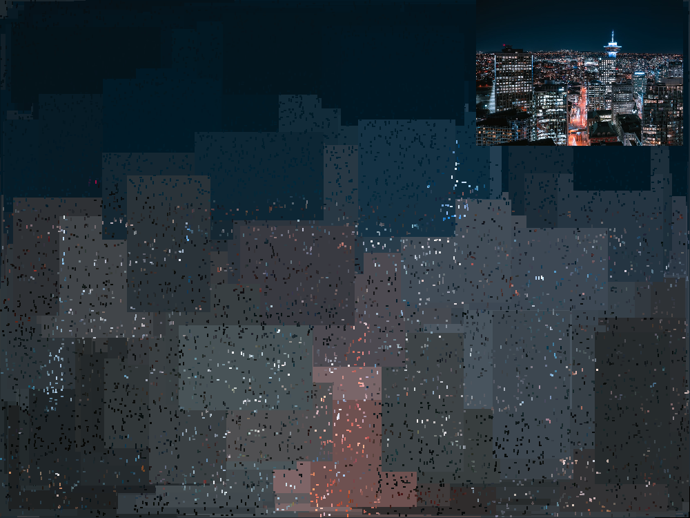
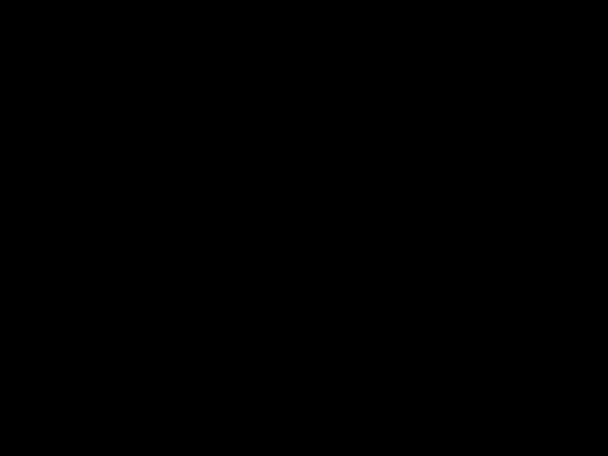
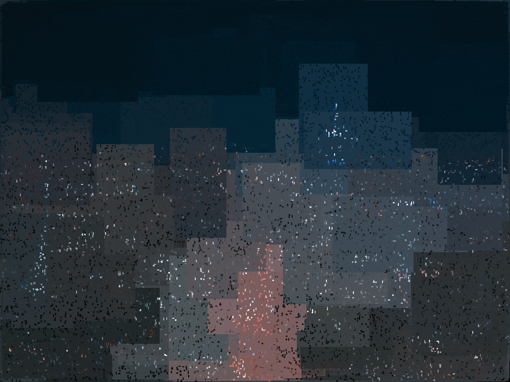
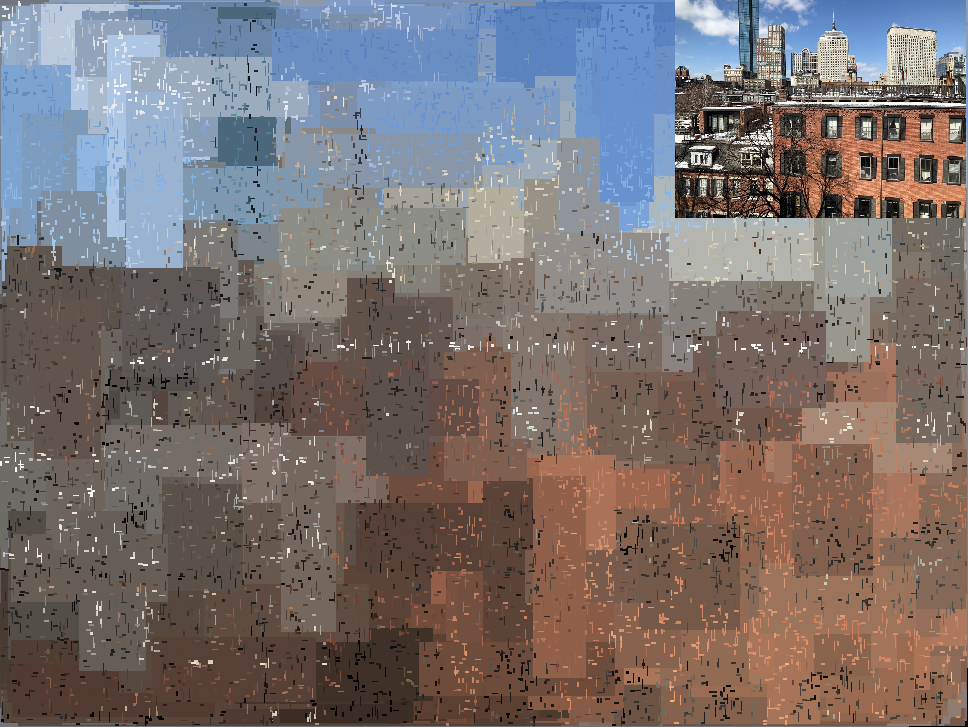
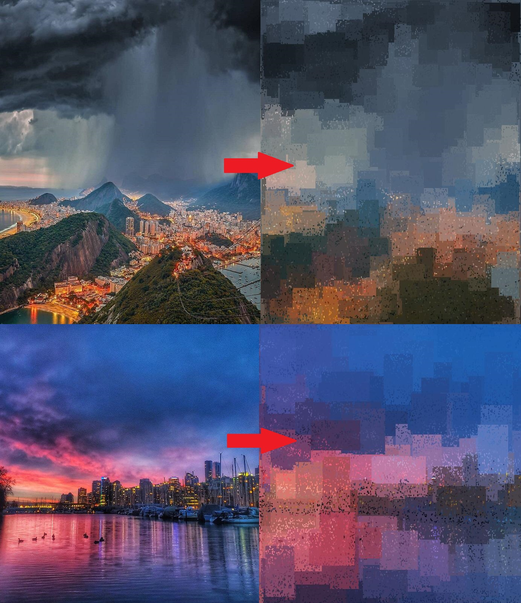

# 🎨 random_shapes

Turn your photos into art. 

## About

This script takes a photo as input and returns an abstract version of it:

## How does it work?

The program uses a number of iterations as input by the user to **randomly** overlay "N" number of rectangles with area "A" (whose range of aspect ratios can be defined) for each iteration. The area and number of rectangles decreases and increases with rates and models entered as desired by the user. Each rectangle is then shaded according to the mean color of the area it covers from the original photo. Here's an example of what happens as you increase the number of iterations in *.gif* format:

There are also two other functions aside from the main "paint" function to help generate frames for making gifs. "gifproducer" increments the number of iterations and saves a picture at the end of each iteration to visualize what happens with increasing iterations (above gif). "gifstatic" on the other hand, will generate the *same* iteration 7 times. Since each frame has some degree of randomness associated with it, sequencing the frames will give it a cool live effect (see below).

## How to use

The main function "paint" is your main brush. It takes the following arguments paint(input,NUM_RECS,A_CONST,N_CONST,ASPECT_RANGE,MODE,DEBUG=False)

Parameter | Meaning
------------ | -------------
input | Filename as string, e.g. 'flowers.png'.
NUM_RECS | The number of iterations, more iterations = more detail.
A_CONST | The characteristic decay constant of the area of the rectangles per iteration.
N_CONST | The characteristic growth constant for the number of rectangles added per iteration.
ASPECT_RANGE | The range of aspect ratios that can be assumed by the rectangles. The aspect ratio is randomly chosen from 1..Aspect ratio and then again randomly chosen between the value or 1/value (length/width).
MODE | 'l' or 'e' which stand for linear or exponential mode. Exponential mode is faster and more realistic but also less artistic and ends up looking like a low resolution version of the image. Try different combinations of constants and modes.
DEBUG| Optional, when turned on it will plot the area of the boxes and the number of boxes as a function of iteration so you can see if your numbers make sense before running the code.

Linear mode, unlike exponential mode, also has a quirk that really brings the renders to life - since the size reduction of the linear rectangles can eventually go to 0 there is a necessity to counteract this. The area will then be forced to 5 or 10 (I used 10) will results in little noise-like features that add imperfections to the boxes but also give it additional depth. For this reason, I found that the following parameters work quite well (for photos with resolution ~700x1000):

    paint(29,0.33,0.55,2,'l')

## More examples

[Source for bottom picture](https://www.reddit.com/r/vancouver/comments/kmrkse/this_morning_was_good_to_us/)

